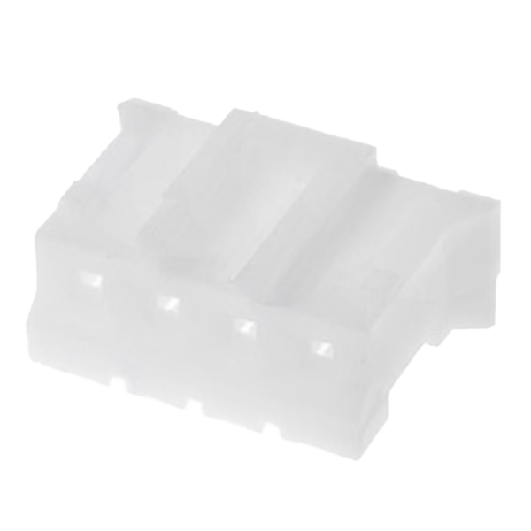
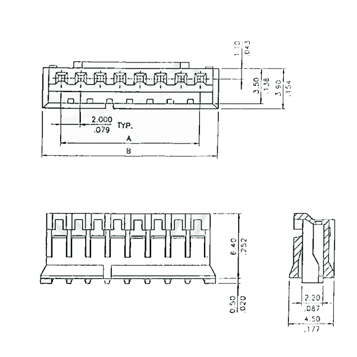
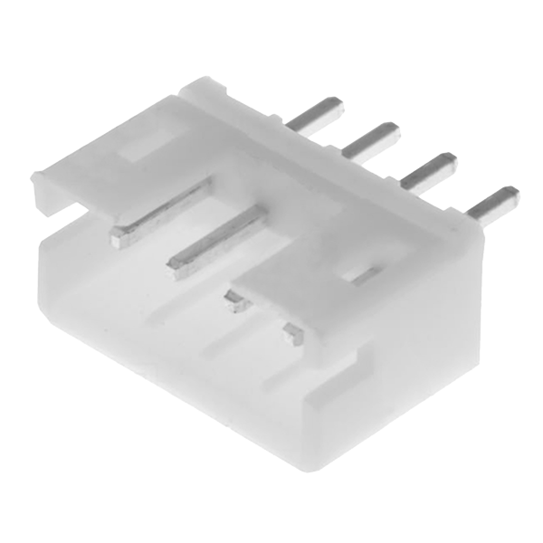
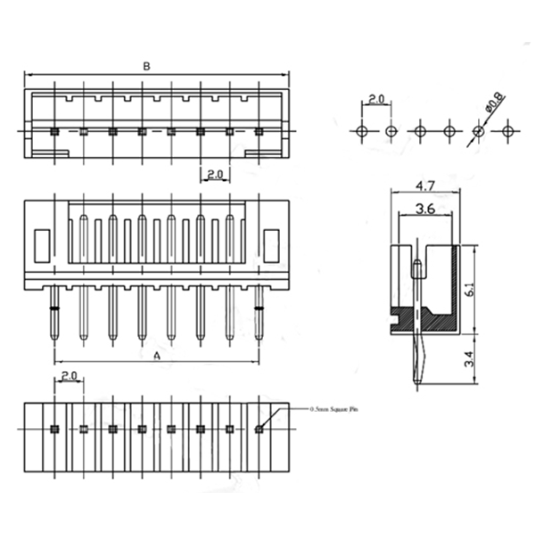
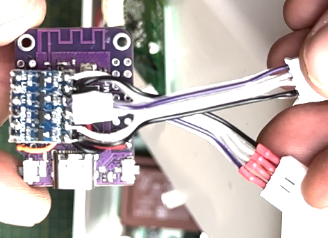

# esphome-cg-rfid
Track the number of cycles to see how much detergent is left in the CatGenie 120

## Features
* Track the number of cycles
* Emulation of the presence of detergent in case it suddenly runs out
* Bypass mode for working with a cartridge

## Supported Microcontrollers
This library should work on most ESP32 platforms. It has been tested
with the following MCUs:
* Wemos S2 Mini board (ESP32-S2FN4R2)

## Usage
### Step 1: Build a control circuit.

The signal levels are TTL 5V which means a level shifter is required when using 
the ESP32 to convert the signals from 5V to 3.3V and vice versa. Also a voltage
regulator is required if you want to power the ESP32 from the 5V of the I2C 
port.

Also you need NX-4 male and female connector to connect the ESP32.

The drawing and table show which pins need to be connected.

NXG:




NXW:




Original wire:
1. RED - 5V
1. BLUE - GND
1. BLACK - SCL
1. WHITE - SDA

| Function | ESP32 | NXG | NXW|
|-|-|-|-|
| 5V | VIN | 1 | 1 |
| GND | GND | 2 | 2 |
| I2C0 SCL | 3 | - | 3 |
| I2C0 SDA | 5 | - | 4 |
| I2C1 SCL | 11 | 3 | - |
| I2C1 SDA | 12 | 4 | - |



### Step 2: Clone this repository into your ESPHome configuration directory

This repository needs to live in your ESPHome configuration directory, as it
doesn't work correctly when used as a Platform.IO library, and there doesn't
seem to be an analog for that functionality for ESPHome code.

On Hass.IO, you'll want to do something like:

* Change directories to your esphome configuration directory.
* `cd config/esphome`
* `git clone https://github.com/uncle-yura/esphome-cg-rfid.git`

### Step 3: Configure your ESPHome device with YAML

Create an ESPHome YAML configuration with the following sections:
 * `esphome: includes: [esphome-cg-rfid]`
 * `logger: baud_rate: 0` - disable serial port logging
 * `switch: - switch component to enable bypass mode`
 * `sensor: - sensor component for remaining cycles`
 * `button: - button component to reset remaining cycles`

# Example configuration

Below is an example configuration which will include wireless strength
indicators and permit over the air updates. You'll need to create a
`secrets.yaml` file inside of your `esphome` directory with entries for the
various items prefixed with `!secret`.

```yaml
esphome:
  name: catgenie-rfid
  friendly_name: catgenie-rfid
  includes:
  - esphome-cg-rfid
  libraries:
  - Wire

esp32:
  board: lolin_s2_mini
  variant: ESP32S2
  framework:
    type: arduino

status_led:
  pin: GPIO15

# Enable logging
logger:
  baud_rate: 0

# Enable Home Assistant API
api:
  encryption:
    key: "your-encryption-key"

ota:
  password: "your-ota-password"

wifi:
  ssid: !secret wifi_ssid
  password: !secret wifi_password

  # Enable fallback hotspot (captive portal) in case wifi connection fails
  ap:
    ssid: "Catgenie-Rfid Fallback Hotspot"
    password: "your-hotspot-password"

captive_portal:

globals:
  - id: bp_var
    type: boolean
    restore_value: true
    initial_value: "true"

switch:
  - platform: template
    id: bypass_switch
    name: "Bypass Switch"
    lambda: return id(bp_var);
    restore_mode: RESTORE_DEFAULT_ON
    turn_on_action:
      - lambda: |-
          id(bp_var) = true;
    turn_off_action:
      - lambda: |-
          id(bp_var) = false;

custom_component:
  - id: cg_rfid
    lambda: |-
      auto cg_rfid = new CG_RFID(id(bypass_switch));
      return {cg_rfid};

button:
  - platform: template
    id: reset_button
    name: "Reset Button"
    on_press:
      then:
        - lambda: 'static_cast<CG_RFID*> (id(cg_rfid).get_component(0))->reset();'

sensor:
  - platform: template
    id: remaining_cycles
    name: "Remaining Cycles"
    lambda: 'return static_cast<CG_RFID*> (id(cg_rfid).get_component(0))->get_remaining_cycles();'
    update_interval: 60s
```

# See Also

## References and sources
Knowledge for creating the logic of monitoring and controlling the device
was assembled by reverse engineering and analyzing the I2C protocol:

* david hamp-gonsalves: <https://github.com/davidhampgonsalves/CR14-emulator-for-CatGenie-120>
